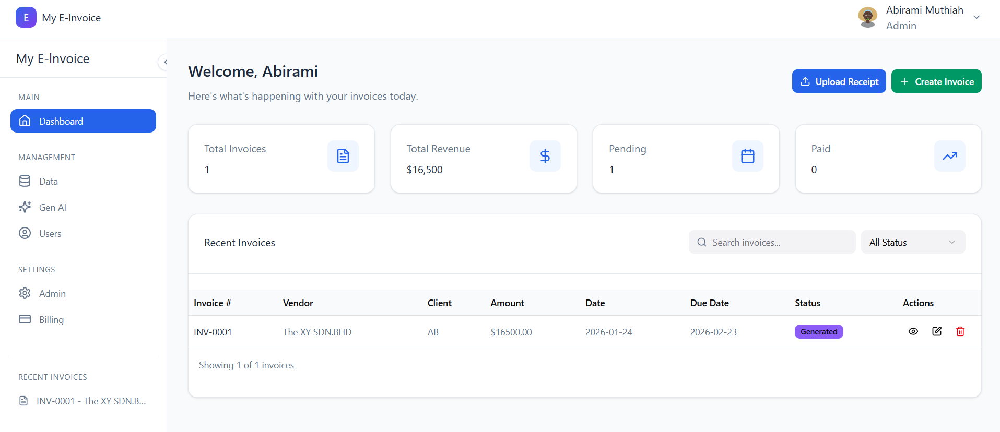
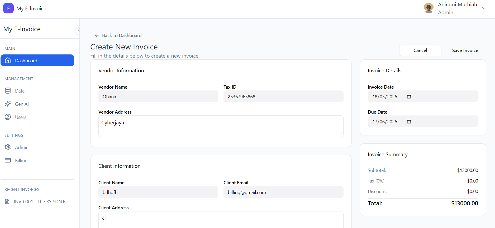

<div align="center">

# AI E-Invoice System

### Invoice Automation and Financial Analytics Platform

<p align="center">
  A full-stack invoice management platform that automates invoice creation, tracks payment status, and provides operational analytics through a modern dashboard — built with Flask, TypeScript, and SQL.
</p>

<br/>


</div>

---

## Overview

AI E-Invoice System is an invoice automation platform for managing client billing, tracking invoice status, and monitoring financial performance. It handles the full invoice lifecycle — from creation to payment tracking — with a clean operational dashboard for business analytics.

Built with a Flask backend, TypeScript/React frontend, and SQL database, the system is designed to replace manual invoicing workflows with an automated, data-driven approach.

---

## Key Features

### Invoice Management

- Create, edit, and delete invoices
- Vendor and client information management
- Due date tracking and status updates (Pending / Paid / Overdue)
- Invoice summary with automatic calculations
- Search and filter across all invoices

### Analytics Dashboard

- Revenue overview and financial KPI cards
- Invoice status breakdown (paid vs pending vs overdue)
- Client-level billing summaries
- Date range filtering for reports

### Workflow Automation

- Automated invoice numbering and organization
- Status updates based on due dates
- Bulk invoice management

---

## Screenshots

### Dashboard Overview



### Create Invoice



---

## System Architecture

```
Frontend (TypeScript / React)
           |
   Flask Backend API
           |
   Invoice Processing Engine
           |
   SQL Database
   (Invoices, Clients, Vendors, Payments)
           |
   Analytics Dashboard
```

---

## Tech Stack

| Category | Technologies                   |
| -------- | ------------------------------ |
| Backend  | Python, Flask                  |
| Frontend | TypeScript, React, TailwindCSS |
| Database | SQL                            |
| Tools    | GitHub, VS Code                |

---

## Getting Started

### Prerequisites

- Python 3.9+
- Node.js 18+

### 1. Clone the Repository

```bash
git clone https://github.com/AbiramiMuthiah/ai-einvoice-system.git
cd ai-einvoice-system
```

### 2. Backend Setup

```bash
cd backend
python -m venv venv

# Windows
venv\Scripts\activate

# Mac/Linux
source venv/bin/activate

pip install -r requirements.txt
python app.py
# Runs on http://127.0.0.1:5000
```

### 3. Frontend Setup

```bash
cd frontend
npm install
npm run dev
# Runs on http://localhost:3000
```

---

## Project Structure

```
ai-einvoice-system/
├── backend/               # Flask API
│   ├── app.py             # Main Flask app
│   └── requirements.txt
├── frontend/              # TypeScript/React frontend
│   ├── src/
│   └── package.json
├── assets/                # Screenshots
│   ├── dashboard-overview.png
│   └── create-invoice.png
└── README.md
```

---

## Future Improvements

- OCR-based receipt and invoice scanning
- Automated tax calculation
- PDF invoice generation and email delivery
- Multi-user authentication with role-based access
- Cloud deployment on AWS EC2
- Real-time financial analytics and forecasting

---

## Author

**Abirami Muthiah**  
Applied AI Engineer | Full-Stack Development | Data Science

[](https://abiramimuthiah-portfolio.vercel.app)
[](https://github.com/AbiramiMuthiah)

---

## License

Licensed under the [MIT License](LICENSE).
